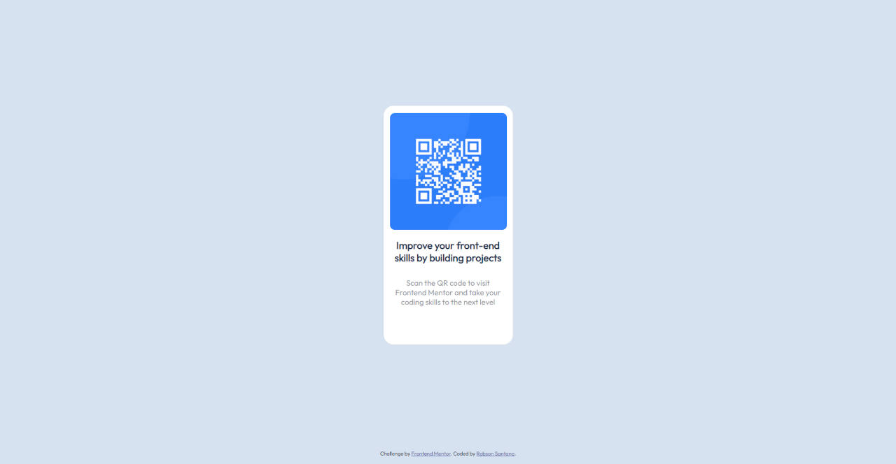

# Frontend Mentor - QR code component solution

This is a solution to the [QR code component challenge on Frontend Mentor](https://www.frontendmentor.io/challenges/qr-code-component-iux_sIO_H). Frontend Mentor challenges help you improve your coding skills by building realistic projects. 

## Table of contents

- [Overview](#overview)
  - [Screenshot](#screenshot)
  - [Links](#links)
- [My process](#my-process)
  - [Built with](#built-with)
  - [What I learned](#what-i-learned)
  - [Continued development](#continued-development)
  - [Useful resources](#useful-resources)
- [Author](#author)

## Overview

### Screenshot



### Links

- Live Site URL: [https://ross1996.github.io/frontend-projects/qrcode/](https://ross1996.github.io/frontend-projects/qrcode/)

## My process

### Built with

- Semantic HTML5 markup
- CSS custom properties
- Flexbox
- Media queries

### What I learned

I improved my knowledge regarding the usage of flex boxes, in which i used it  to center the items in the middle of the page.

```css
  main {
    height: 97vh;
    display: flex;
    justify-content: center;
    align-items: center;
  }
```

### Continued development

I will work on refining my usage of media queries in order to improve responsiveness, as well as start developing pages in a mobile-first workflow.

### Useful resources

- [Flexbox](https://www.w3schools.com/css/css3_flexbox.asp) - This tutorial helped me in the usage of flexbox.
- [Media Queries](https://www.w3schools.com/css/css_rwd_mediaqueries.asp) - This tutorial helped me in the usage of media queries.


## Author

- Frontend Mentor - [@ROSS1996](https://www.frontendmentor.io/profile/ROSS1996)

