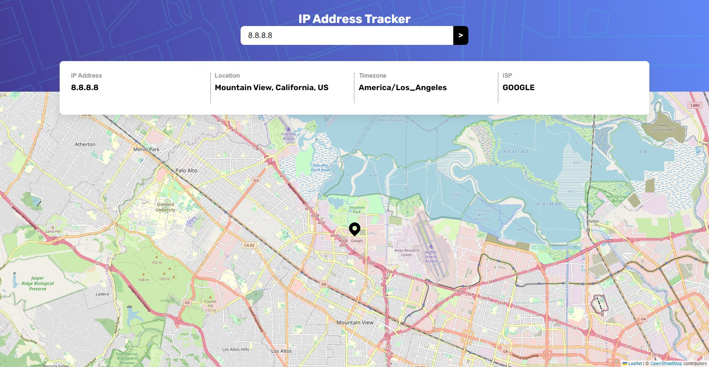

# Frontend Mentor - IP address tracker solution

This is a solution to the [IP address tracker challenge on Frontend Mentor](https://www.frontendmentor.io/challenges/ip-address-tracker-I8-0yYAH0). Frontend Mentor challenges help you improve your coding skills by building realistic projects. 
## Table of contents

- [Overview](#overview)
  - [Screenshot](#screenshot)
  - [Links](#links)
- [My process](#my-process)
  - [Built with](#built-with)
  - [What I learned](#what-i-learned)
- [Author](#author)

## Overview

### Screenshot

### Links

- Live Site URL: [https://ross1996.github.io/frontend-projects/iptrack-int/](https://ross1996.github.io/frontend-projects/iptrack-int/)

## My process

### Built with

- Semantic HTML5 markup
- CSS custom properties
- Flexbox
- CSS Grid
- Javascript
- [LeaftletJS](https://leafletjs.com/)

### What I learned

I learned how to setup a basic map with LeafletJS

## Author

- Frontend Mentor - [@ROSS1996](https://www.frontendmentor.io/profile/ROSS1996)
