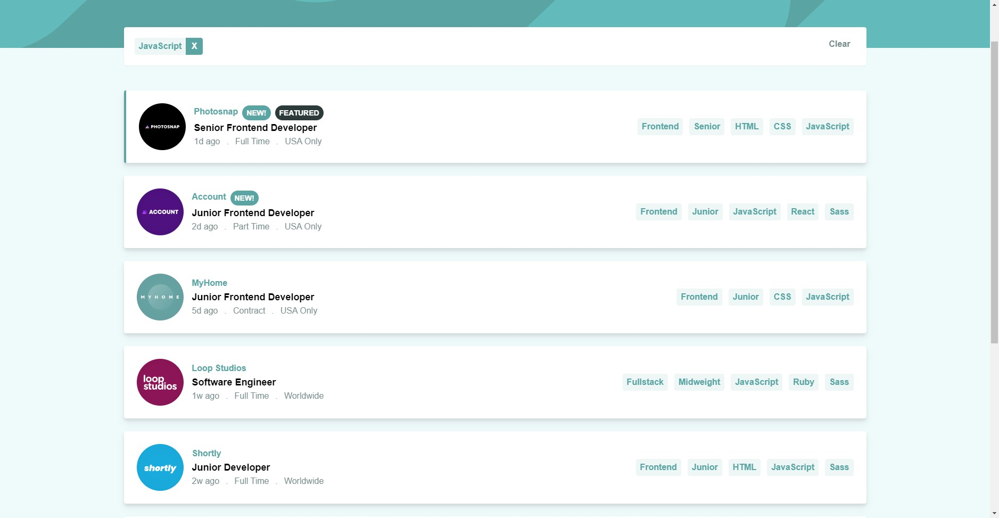

# Frontend Mentor - Job listings with filtering solution

This is a solution to the [Job listings with filtering challenge on Frontend Mentor](https://www.frontendmentor.io/challenges/job-listings-with-filtering-ivstIPCt). Frontend Mentor challenges help you improve your coding skills by building realistic projects.

- [Overview](#overview)
  - [Screenshot](#screenshot)
  - [Links](#links)
- [My process](#my-process)
  - [Built with](#built-with)
  - [What I learned](#what-i-learned)
- [Author](#author)

## Overview

### Screenshot

### Links

- Live Site URL: [https://ross1996.github.io/frontend-projects/joblist-int/dist/](https://ross1996.github.io/frontend-projects/joblist-int/dist/)

## My process

### Built with

- Semantic HTML5 markup
- CSS custom properties
- Flexbox
- Javascript
- [ReactJS](https://reactjs.org/)
- [Vite](https://vitejs.dev/)
- [TailwindCSS](https://tailwindcss.com/)

### What I learned

I learned how to setup a filter system by passing 'filters' state and setter function through each components. Those filters serve as conditionals to render each object in the JSON.

I also learned how to create static github pages with Vite without the need of creating a new repo by adding "**base: './'**" in the vite.config.js file.

## Author

- Frontend Mentor - [@ROSS1996](https://www.frontendmentor.io/profile/ROSS1996)
