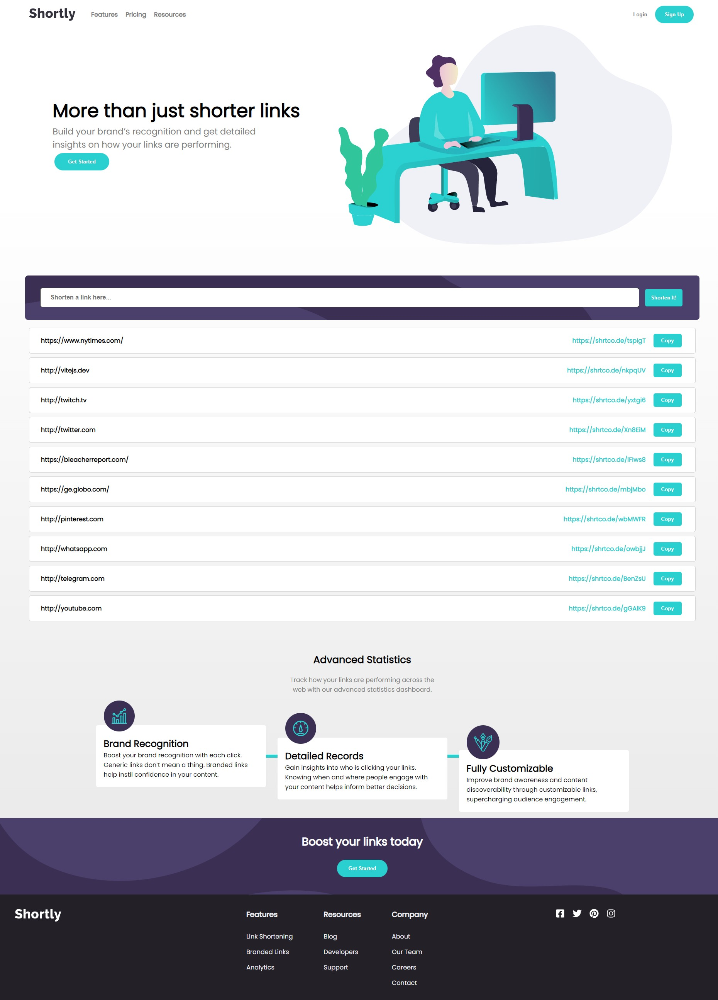

# Frontend Mentor - Shortly URL shortening API Challenge solution

This is a solution to the [Shortly URL shortening API Challenge challenge on Frontend Mentor](https://www.frontendmentor.io/challenges/url-shortening-api-landing-page-2ce3ob-G). Frontend Mentor challenges help you improve your coding skills by building realistic projects.

- [Overview](#overview)
  - [Screenshot](#screenshot)
  - [Links](#links)
- [My process](#my-process)
  - [Built with](#built-with)
  - [What I learned](#what-i-learned)
- [Author](#author)

## Overview

### Screenshot

### Links

- Live Site URL: [https://ross1996.github.io/frontend-projects/linkshort-int/dist/](https://ross1996.github.io/frontend-projects/linkshort-int/dist/)

## My process

### Built with

- Semantic HTML5 markup
- CSS custom properties
- Flexbox
- Javascript
- [ReactJS](https://reactjs.org/)
- [Vite](https://vitejs.dev/)
- [Sass](https://sass-lang.com/)

### What I learned

- I learned how to build an Hamburger Menu.

- I learned how to save local data in the browser and load after refresh.

## Author

- Frontend Mentor - [@ROSS1996](https://www.frontendmentor.io/profile/ROSS1996)
