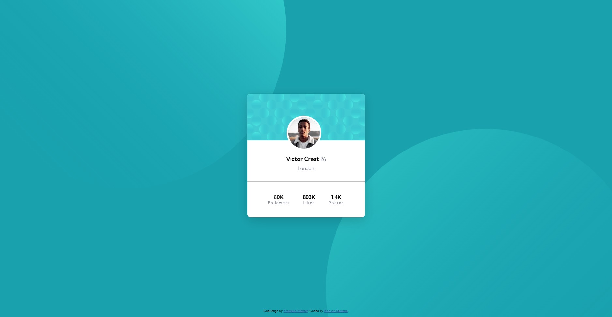

# Frontend Mentor - Profile card component solution

This is a solution to the [Profile card component challenge on Frontend Mentor](https://www.frontendmentor.io/challenges/profile-card-component-cfArpWshJ). Frontend Mentor challenges help you improve your coding skills by building realistic projects. 
## Table of contents

- [Overview](#overview)
  - [Screenshot](#screenshot)
  - [Links](#links)
- [My process](#my-process)
  - [Built with](#built-with)
  - [Useful resources](#useful-resources)
- [Author](#author)

## Overview

### Screenshot

### Links

- Live Site URL: [https://ross1996.github.io/frontend-projects/pccomp-nb/](https://ross1996.github.io/frontend-projects/pccomp-nb/)

## My process

### Built with

- HTML5
- CSS

### Useful resources

- [CSS Float](https://www.w3schools.com/css/css_positioning.asp) - This tutorial helped me in the usage of css float.

## Author

- Frontend Mentor - [@ROSS1996](https://www.frontendmentor.io/profile/ROSS1996)

