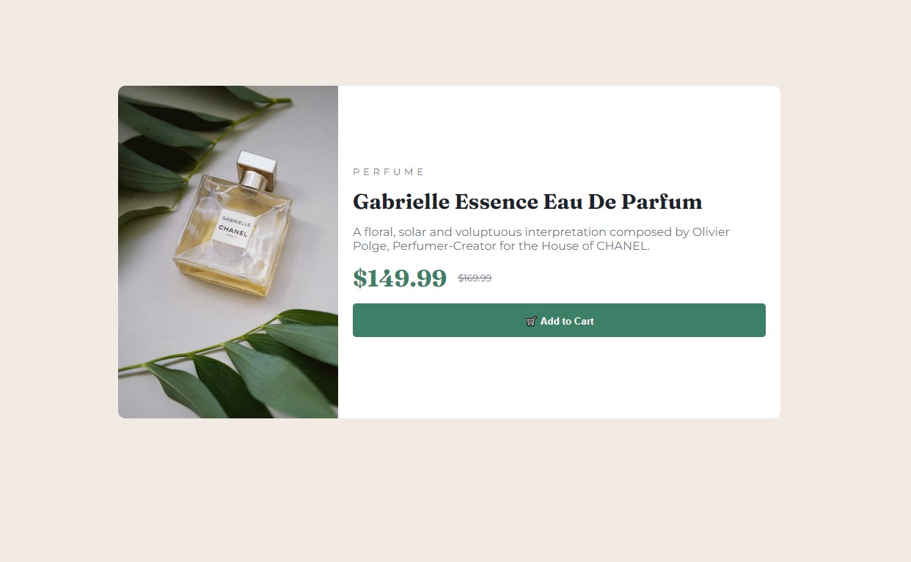

# Frontend Mentor - Product preview card component solution

This is a solution to the [Product preview card component challenge on Frontend Mentor](https://www.frontendmentor.io/challenges/product-preview-card-component-GO7UmttRfa). Frontend Mentor challenges help you improve your coding skills by building realistic projects. 

## Table of contents

- [Overview](#overview)
  - [Screenshot](#screenshot)
  - [Links](#links)
- [My process](#my-process)
  - [Built with](#built-with)
  - [Useful resources](#useful-resources)
- [Author](#author)

## Overview

### Screenshot

### Links

- Live Site URL: [https://ross1996.github.io/frontend-projects/ppcc-nb/](https://ross1996.github.io/frontend-projects/ppcc-nb/)

## My process

### Built with

- Semantic HTML5 markup
- CSS custom properties
- Flexbox
- Media queries
### Useful resources

- [Flexbox](https://www.w3schools.com/css/css3_flexbox.asp) - This tutorial helped me in the usage of flexbox.
- [Media Queries](https://www.w3schools.com/css/css_rwd_mediaqueries.asp) - This tutorial helped me in the usage of media queries.

## Author

- Frontend Mentor - [@ROSS1996](https://www.frontendmentor.io/profile/ROSS1996)

