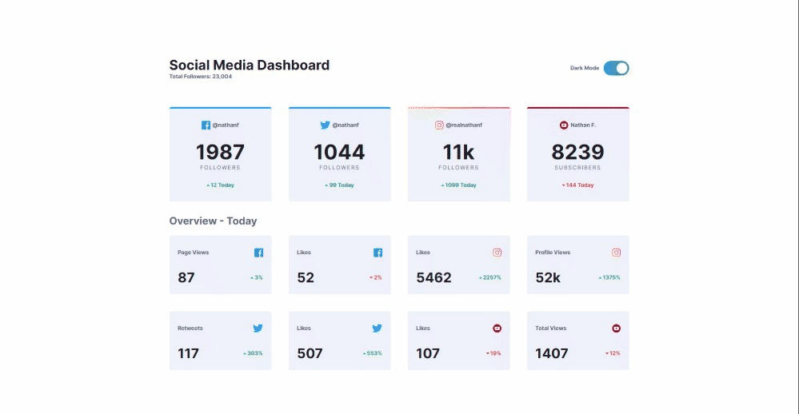

# Frontend Mentor - Social media dashboard with theme switcher

## Table of contents

- [Overview](#overview)
  - [Screenshot](#screenshot)
  - [Links](#links)
- [My process](#my-process)
  - [Built with](#built-with)
  - [What I learned](#what-i-learned)
- [Author](#author)

## Overview

### Screenshot



### Links

- Live Site URL: [https://ross1996.github.io/frontend-projects/smdt-junior/](https://ross1996.github.io/frontend-projects/smdt-junior/)

## My process

### Built with

- Semantic HTML5 markup
- CSS custom properties
- Flexbox
- CSS Grid
- Javascript

### What I learned

I learned how to switch between light and dark modes:

```html
<meta name="color-scheme" content="dark light" />
```

```css
.mode:root {
  --bg-color-x: #000;
}
.dark-mode:root {
  --bg-color-x: #000;
}

.body {
  background-color: var(--bg-color-x);
}
```

I learned how to create gradient borders with rounded corner:

```css
.rounded-gradient {
  border-top: double 4px transparent;
  border-radius: 4px;
  background-image: linear-gradient(var(--bg-color), var(--bg-color)), linear-gradient(to right, hsl(37, 97%, 70%), hsl(329, 70%, 58%));
  background-origin: border-box;
  background-clip: padding-box, border-box;
}
```

I learned how to create a switch component with pure HTML and CSS

```html
<label class="switch">
  <input type="checkbox" id="switchStatus" checked/>
  <span class="slider"></span>
</label>
```

```css
.switch {
    position: relative;
    display: inline-block;
    width: 60px;
    height: 34px;
}

.switch input {
    opacity: 0;
    width: 0;
    height: 0;
}

.slider {
    position: absolute;
    cursor: pointer;
    top: 0;
    left: 0;
    right: 0;
    bottom: 0;
    background-color: rgb(41, 41, 248);
    -webkit-transition: .4s;
    transition: .4s;
    border-radius: 34px;
}

.slider:before {
    position: absolute;
    content: "";
    height: 26px;
    width: 26px;
    left: 4px;
    bottom: 4px;
    background-color: var(--toggle);
    -webkit-transition: .4s;
    transition: .4s;
    border-radius: 50%;
}

input:checked+.slider {
    background-color: rgb(128, 128, 248);
}


input:checked+.slider:before {
    -webkit-transform: translateX(26px);
    -ms-transform: translateX(26px);
    transform: translateX(26px);
}
```

To make this switcher work, JS is used to check the status of the slider. That script also saves that preference locally.

```js
let switcher = document.getElementById('switchStatus')
switcher.addEventListener('change', () => {
    html.classList.toggle('dark-mode')
    let mode = localStorage.getItem("colorScheme");
    if (mode === 'light' || mode === null) { localStorage.setItem("colorScheme", "dark")}
    else if (mode === 'dark' || mode === null) { localStorage.setItem("colorScheme", "light");}
})
```

## Author

- Frontend Mentor - [@ROSS1996](https://www.frontendmentor.io/profile/ROSS1996)
